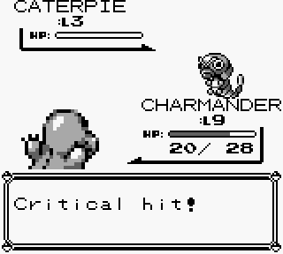
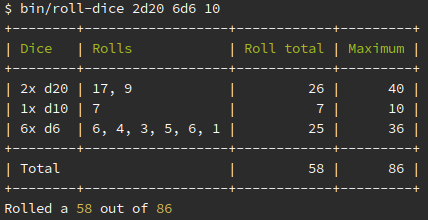
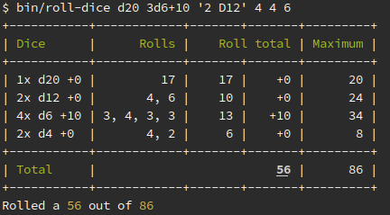

# Dice rolling for nerds

In-between projects and work, I came across
[a little gem called YesDice](https://github.com/vssr/yesdice).
It compelled me to write [a similar solution in PHP](https://github.com/ZeroConfig/D-Roll).

Rolling dice is part of any nerds life. Whether it's just for a game of Yahtzee,
a simple board game or maybe a full-fledged D&D campaign. Rolling dice will be
part of your life.

## A bit of background

Even if you don't play board games or games that use dice, you may be surprised
to know that RPGs like Pokémon or Final Fantasy still use the mechanic of
rolling dice. You may have seen a screen like this before:

That happens with a given chance. That chance is based on the same principle as
rolling a die.

Dice come in a huge number of variations. The most common die is the D6. Where D
stands for Die and 6 for the number of eyes. Therefore, it is a die that goes
from 1 to 6.

In role playing games, you are likely to find one of these laying around:

A D20 is a die with 20 eyes, ranging from 1 to 20. 

An [article on nerdist](http://nerdist.com/this-d120-is-the-largest-mathematically-fair-die-possible/)
explains why a D120 is the highest fair number die. However, normally they do not
exceed the D100.

## Enter madness

When rolling dice in a game like D&D, you can find yourself in scenarios like:

Roll 2 times a D20, 6 D6, a D10 and re-roll the D10 if it's a crit.

Let's see. I need 2 of the big ones. Ah, here is a D10. Or is it a D12?
Wait I see an eleven. That must be a D12. Oh, here are a couple of D6's. How many
did I need again? Wait. I only have 4 D6's, so I need to re-roll 2 and keep the
previous rolls in mind, but then I need to remember that I can still re-roll the
D10.

It becomes a pain really quickly and the cool part is, next turn you can probably
do it all over again.

You may find a nice fellow player that wants to lend you their dice to complement
your roll, but players can be really superstitious about lending out dice.
It can be a form of bad luck.

As with everything in this world,
[there is an app for that](https://play.google.com/store/apps/details?id=com.dasa.diceroller),
but what fun is that, as a programmer?

I already carry my character sheet on my laptop. Going through it by phone is a
real pain. And the benefit is that modifying a character does not require printing
out a new sheet.

So let's try that again. `2D20 6D6 D10`:

Now, that was easy! It is in a package I wrote, called [D-Roll](https://github.com/ZeroConfig/D-Roll).

## Final thoughts

One thing you may notice though, is that it does not support modifiers yet. There
are currently 3 features I've been thinking about:

* <del>Adding modifiers, to support rolls like `4D6+10`.</del> The current version supports it :)
* Allow the eyes of a die to get translated to labels, like ♥.
* Store the dice configuration under a name, like "Magic missile".

Oh yeah. Don't forget: Happy dice rolling :)

Updated interface:

